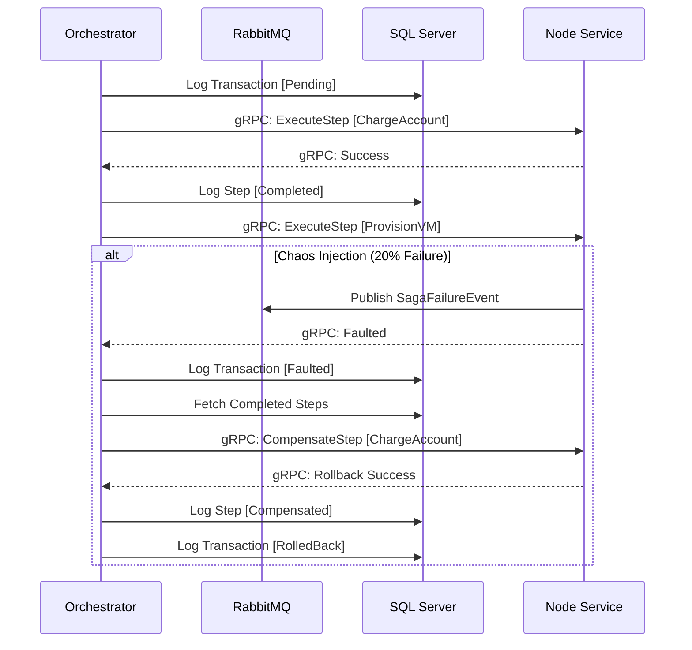

# Nexus — Distributed Saga Workflow Engine

## Executive Summary
Nexus is a highly resilient, containerized distributed workflow engine engineered to manage complex transactions across scalable microservices using the Saga Pattern. It guarantees absolute eventual consistency by automatically orchestrating forward-execution RPCs and seamlessly rolling back failed distributed state mutations across remote nodes without the bottleneck of two-phase locking commits.

## Core Architecture Pillars

### 1. State Machine Persistence
A master database managed by Entity Framework Core running on SQL Server inherently tracks every granular transactional progression. If the orchestrator faults mid-process or a node crashes, its state engine natively resumes executing its queue via strict, durable idiosyncrasies without unwanted side effects.

### 2. Event-Driven Communication
Nexus utilizes a dual-path communication topology. Lightweight, strongly typed **gRPC** protocols govern synchronous Node function executions mapping our transaction logic, while a high-throughput **RabbitMQ** pipeline operates as the central asynchronous broker natively ingesting remote node sub-failure events.

### 3. Distributed Resilience & Chaos Engineering
Network faults in distributed computing are a mathematical certainty. Nexus employs **Polly** to envelop inter-node communications in jittered exponential backoffs. Furthermore, the cluster maintains a built-in "Chaos Monkey" node service executing an autonomous 20% randomized failure rate on heavy allocations (e.g., `ProvisionVM`) to continuously prove auto-compensation, self-healing durability under live stress.

## Visual Flow: The Saga Lifecycle



## Tech Stack

| Component | Technology | Purpose |
| :--- | :--- | :--- |
| **Runtime** | .NET 8 | Performance-optimized cross-platform C# framework |
| **RPC** | gRPC / Protocol Buffers | Low-latency binary point-to-point payload communication |
| **Message Broker** | RabbitMQ | Dead-lettering and asynchronous message edge staging |
| **Persistence** | SQL Server / EF Core | Master state machine, fluid schema integrity |
| **Resiliency** | Polly | Exponential retry policies, persistent fault bridging |
| **Cloud Target** | Docker Compose | Multi-container unified orchestration |

## Quick Start

The entire multi-node architecture is containerized natively via Docker. Follow these steps to initialize the SQL persistence layer, message queues, logic nodes, and central orchestrator concurrently.

1. **Deploy the Cluster**
   Spin up the isolated Docker composition in detached mode:
   ```bash
   docker-compose up --build -d
   ```

2. **Monitor the Distributed Activity**
   Watch the live telemetry as the Orchestrator sequences transactions and organically resolves our simulated Chaos Monkey drops:
   ```bash
   docker-compose logs -f
   ```
